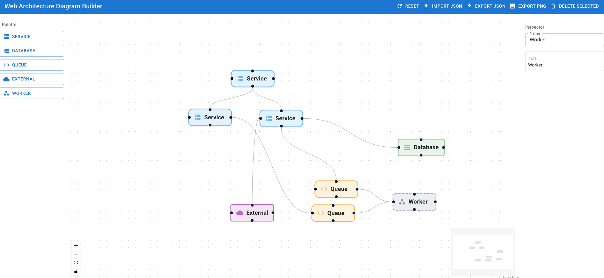

Web Architecture Diagram Builder

An engineering-first visual editor to model distributed monoliths and service architectures. Built with React, TypeScript, Vite, React Flow, and MUI. No backend required. Diagrams persist in the browser (localStorage) and can be exported/imported as JSON and exported as PNG.

Screenshot

Contents
- What’s included (features)
- Requirements & installation
- Run locally
- How to use (step by step)
- Export / import / autosave
- Tips & troubleshooting
- Architecture notes
- License

What’s included (features)
- Infinite canvas with pan/zoom (React Flow), mini-map, and standard controls (zoom/fit).
- Left-side palette to quickly add nodes of types:
  - Service, Database, Queue, External, Worker.
- Custom node cards with icons and type; Worker is rendered with a dashed border.
- Connection handles on each side of a node to connect from/to any side.
- Right-side inspector for the selected node:
  - edit name (Name), view node type.
- Create edges by dragging from a source handle to a target handle.
- Top toolbar actions:
  - Reset — reset the diagram to defaults;
  - Import JSON — import from a JSON file;
  - Export JSON — download current diagram as JSON;
  - Export PNG — download the current canvas as PNG;
  - Delete Selected — remove selected nodes/edges.
- Autosave: the current diagram state is automatically stored in localStorage.

Requirements
- Node.js 18+
- npm 9+ (or a compatible version shipped with Node 18)

Installation
1) Install dependencies:
   npm install

Run locally
1) Dev server (hot reload):
   npm run dev
   Open the URL printed in the terminal (typically http://localhost:5173).

2) Build for production:
   npm run build

3) Preview the production build:
   npm run preview

How to use
1) Add nodes
   - In the left “Palette”, click the desired type: Service, Database, Queue, External, Worker.
   - A node will appear on the canvas; drag it with the mouse to reposition.

2) Connect nodes
   - Hover a node to reveal side handles.
   - Drag from a source handle and drop on a target handle of another node.

3) Select and edit
   - Click a node to select it and show its properties in the right “Inspector”.
   - Use the “Name” field to rename the node.

4) Delete
   - Select one or more nodes/edges (click or box-select in React Flow) and click “Delete Selected” in the top bar.

5) Zoom and navigate
   - Use mouse wheel/trackpad to zoom; hold right mouse button/space to pan (exact behavior may vary by browser/OS).
   - The mini-map in the bottom-right helps navigate large diagrams.

Export / import / autosave
- Export JSON
  - Click “Export JSON”. A file with node and edge arrays will be downloaded.
- Import JSON
  - Click “Import JSON”. Choose a previously saved JSON — the diagram will be restored.
- Export PNG
  - Click “Export PNG” to save the current canvas as an image.
- Reset
  - Click “Reset” to restore the default example state.
- Autosave
  - The diagram state is automatically stored in the browser’s localStorage under an internal key. It is local to the current browser and device.

Tips & troubleshooting
- I see a blank screen after starting
  - Open the dev server URL from the terminal. Try “Reset” in the top bar.
- I want to start from scratch (ignore autosaved state)
  - Click “Reset” or clear the site’s localStorage in your browser settings.
- SVG export / typed edges
  - SVG export and typed edges are not available yet.
- Browser compatibility
  - Tested in current Chromium-based browsers and Firefox. For best results, use recent versions.

Architecture notes
- Fully frontend application, no server. The source of truth is React Flow state (nodes/edges), which is exported/imported as JSON.
- UI: React + MUI; canvas: React Flow; PNG export uses html-to-image; JSON export uses the Blob download API.
- Key screen code: src/App.tsx. Entry wiring: src/main.tsx, index.html.

License
Private/internal for now.